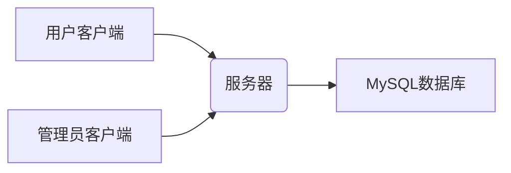

# 项目的整体规划

项目暂时被划分为三个阶段。

**第一阶段**

1. 设计系统功能
2. 配置相关环境

**第二阶段**

1. 完善基础设计
   1. 网络模块，转发字节流
   2. 解析与析构
   3. 

**第三阶段**

1. 完善客户端

# 项目的一些细节

在第一阶段，项目使用的技术栈为C++11，Linux系统编程、MySQL、开源库：Sonic-Cpp。

在第二阶段，项目将融入QT设计windows客户端。

第三阶段，项目将考虑多方面优化。

## 使用面向对象编程的思想来设计程序

## 使用MySQL保存数据

-   用户表：存储用户的注册信息（id, name, password）、联系人信息、身份信息；

-   车站表：存储已有车站，并编号

-   车次表：存储车次的座位类型、余票数量等。

-   经停站表：存储哪个列车什么时候到本站、停多久，到下一站还要多久，到下一站车票多贵，最后对经停站编号。

-   订单表：存储订单的订单号、用户ID、车次ID、订单时间、支付方式、支付状态、退改状态， 记录车票属性。

-   评价表：存储评价的评价ID、用户ID、车次ID、评价内容、评价时间等。

## 使用Sonic-Cpp JSON库作为程序内外部的信息沟通方式

1.   JSON对象创建
2.   JSON对象中添加对象
3.   JSON对象中删除对象
4.   JSON对象与字符串的转换

## 第一阶段项目细节 (服务器功能需求)

### 关于协议的选取

由于使用QT开发windows与linux客户端，使用C++开发linux服务器，我采用TCP协议;

TCP协议是一种可靠的、有序的、面向连接的传输层协议，它可以保证数据的完整性和正确性，适合传输大量或重要的数据。TCP协议也是Qt和C++网络编程中常用的协议，可以使用Qt提供的QTcpSocket类和C++提供的socket函数来实现TCP通信。

-   TCP通信的优点：

    -   TCP通信可以实现双向、全双工的数据传输，即客户端和服务器可以同时发送和接收数据。
    -   TCP通信可以实现流量控制和拥塞控制，通过窗口机制、慢启动、拥塞避免等方法，根据网络状况和接收方能力，动态调整发送速率，避免网络拥塞。
    -   TCP通信可以实现数据重传和确认机制，通过序号、确认号、校验和等方法，解决了数据丢包、乱序、重复、错误等问题。

-   TCP通信的参考资料：

    -   [一、Linux和Windows以及QT下的网络编程的TCP_qtcpsocket通信服务器运行在linux上客户端运行在windows上_曲线 …](https://blog.csdn.net/qq_30972905/article/details/104917866)：这篇文章介绍了如何在Linux和Windows下使用C++和Qt实现TCP服务器和客户端的编程。
    -   [Qt项目中TCP通信的实现方式经验总结（客户端部分） - 知乎](https://zhuanlan.zhihu.com/p/113103834)：这篇文章总结了在Qt项目中使用QTcpSocket类实现TCP客户端的方法和注意事项。
    -   [基于Qt实现USBCDC便携式设备串口通信客户端设计资源-CSDN文库](https://download.csdn.net/download/weixin_38718415/12611776)：这篇文章介绍了如何使用Qt设计一个串口通信客户端的图形界面，并根据Linux下串口通信的应用层协议，实现与便携式设备的数据交互。

    但是TCP协议的数据无边界信，我会自己封装一个新的协议：

## 数据格式（JSON）

规范数据传输；

## 第二阶段项目细节(客户端功能需求)

### 概述

本程序是一个基于客户端-服务器架构的应用程序，旨在实现用户和管理员之间的交互以及与数据库的数据交互。

### 功能列表

以下是本程序的主要功能列表：

#### 用户功能：

注册账户：用户可以通过客户端注册一个新的账户。

登录账户：已注册的用户可以使用客户端登录到系统。

浏览产品：用户可以查看在数据库中存储的产品列表。

添加到购物车：用户可以将产品添加到购物车中。

下订单：用户可以将购物车中的产品生成订单。

查看订单历史：用户可以查看自己的订单历史。

#### 管理员功能：

登录账户：已注册的管理员可以使用客户端登录到系统。

添加产品：管理员可以向数据库中添加新的产品。

更新产品信息：管理员可以更新数据库中现有产品的信息。

删除产品：管理员可以从数据库中删除产品。

查看订单历史：管理员可以查看所有用户的订单历史。

### 架构图

### 技术选型

### 数据库设计

本程序的MySQL数据库将包括以下表格（表格字段列举的仅为示例，实际根据需求进行调整）：

### 开发计划
-   需求分析和设计阶段：

    -   确定详细的功能需求和用户界面设计。
    -   设计数据库结构。
    -   定义API接口和数据传输格式。
-   服务器开发阶段：
    -   使用选定的后端技术进行服务器端的开发。
    -   实现服务器端的接口和数据处理逻辑。
    -   数据库开发阶段：
    -   创建MySQL数据库并实现相应的表格结构。
    -   实现数据库相关的增删改查操作。
-   客户端开发阶段：
    -   使用QT进行用户客户端的开发。
    -   实现用户功能的相应界面和交互逻辑。
-   集成和测试阶段：
    -   将客户端、服务器和数据库进行集成测试。
    -   修复和优化程序中的问题和缺陷。
-   部署和发布阶段：
    -   部署程序到合适的服务器环境。
    -   配置相关的服务器设置和参数。
    -   发布程序供用户使用。

